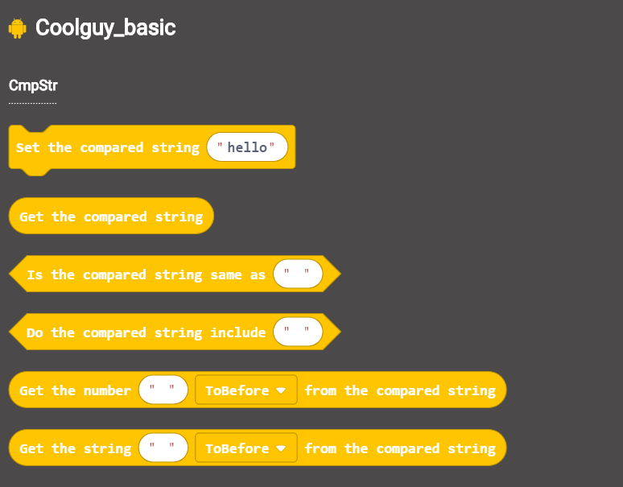

# Coolguy_basic_extension

Coolguy basic extension for Makecode.

## Feature

- On board battery source
- Drive two motors at the same time
- Two IIC communication interface is available
- 

## Link to product page

http://www.coolguyrobot.com/down/Microbit%E6%89%A9%E5%B1%95%E6%9D%BF%E5%8F%8AMakecode%E4%BD%BF%E7%94%A8%E8%AF%B4%E6%98%8E.pd

# Blocks Preview

# Hardware Preview

## License

MIT

## Supported targets

* for PXT/microbit (The metadata above is needed for package search.)

